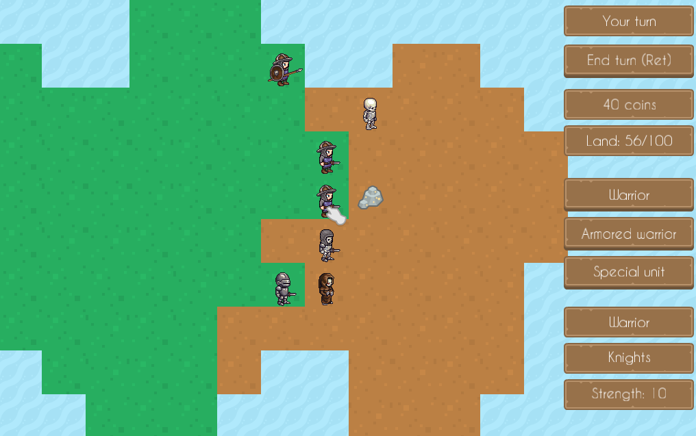
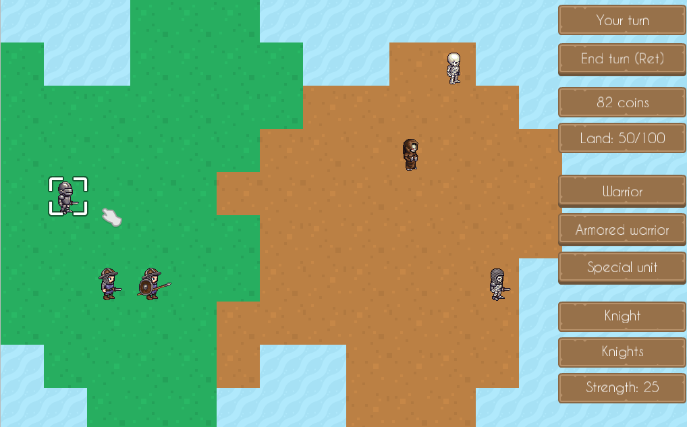
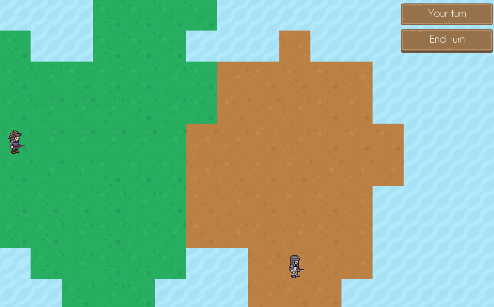
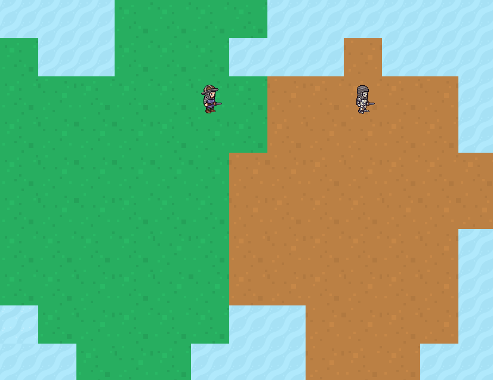
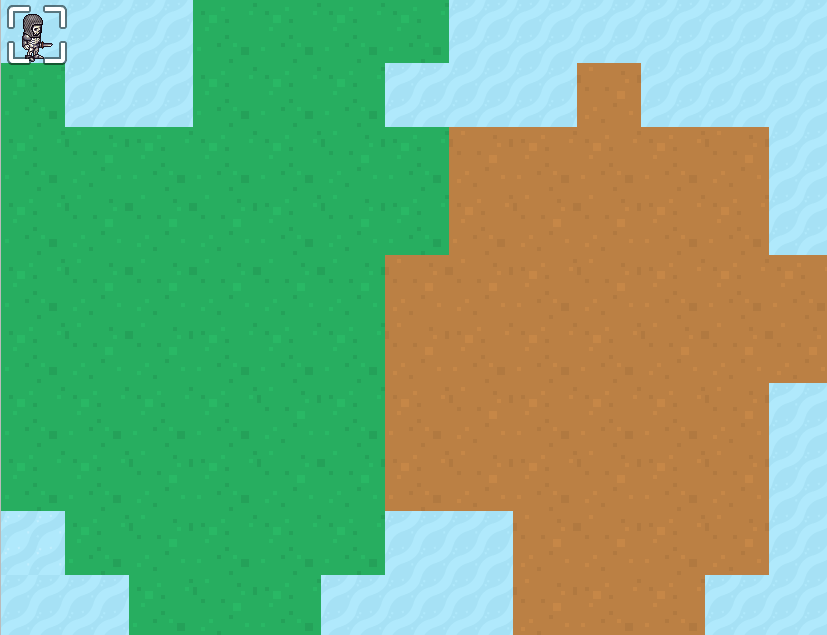

# Knight General
## Turn-based strategy for Ludum Dare 42. Theme: Running out of space

Gameplay video: https://www.youtube.com/watch?v=wPX_rOMkLKs

Blog post: https://lchsk.com/making-a-turn-based-strategy-game-in-cpp-in-72-hours.html

Ludum Dare 42 entry: https://ldjam.com/events/ludum-dare/42/knight-general



## Description

Knight General is inspired by classic turn-based strategy games. The aim of the game is to control the whole map (so that the enemy 'runs out of space'). To do so, a player can move their units into enemy territory, thus increasing their possessions. Each player can buy more units, all of which can fight the enemies and collect resources. Units are bought with coins, which each player collects by:
- gathering resources
- receiving a payout at the beginning of each turn, which depends on the size of owned land

### Features

- two powerful sides: knights and skeletons
- each side has three different units
- difficult AI opponent
- several types of resources (gold, stone, timber, trees) which can be collected and sold to receive coins

## Installation

1. Make sure you have SFML library installed: on Ubuntu `sudo apt install libsfml-dev`

2. Download DEB or ZIP package.

3. Install DEB package: `sudo apt install ./knight-general-0.1.0-Linux.deb`

4. Go to directory with `knight-general` executable (possibly `/usr/games`), and run `./knight-general`

5. If you're using the ZIP archive, unzip it, then find `knight-general` executable and run it.

## Requirements

Tested on Ubuntu 17.10 but it should be easy to build on other free systems and probably on Mac/Windows as well.

### Dependencies

- SFML (tested with v2.4.2)
- modern C++ compiler, supporting at least C++14

## Building from source

Install dependencies on Ubuntu:

`sudo apt install libsfml-dev`

```
1. Clone the repo
2. mkdir build && cp -r knight_general_assets/ build/ && cd build
3. cmake ..
4. make -j
5. ./knight-general
```

## Assets

### Graphics

- https://opengameart.org/content/medieval-rts-120 by Kenney (public domain)

- https://opengameart.org/content/lpc-medieval-fantasy-character-sprites by wulax (CC-BY-SA 3.0 GPL 3.0)

- https://opengameart.org/content/ui-pack-rpg-extension by Kenney (public domain)

- https://opengameart.org/content/crosshair-pack-200%C3%97 by Kenney (public domain)

### Music

- https://opengameart.org/content/adventure-begins by bart (GPL 3.0)

### Fonts

- https://www.dafont.com/caviar-dreams.font by Lauren Thompson (100% free)

## Version info

`./knight-general --version`

## Screenshots

13/08/2018 20:42 BST - almost final version


12/08/2018 20:27 BST - basic gui


12/08/2018 11:50 BST - two units


11/08/2018 18:05 BST - unit on a map


11/08/2018 14:56 BST - basic map


