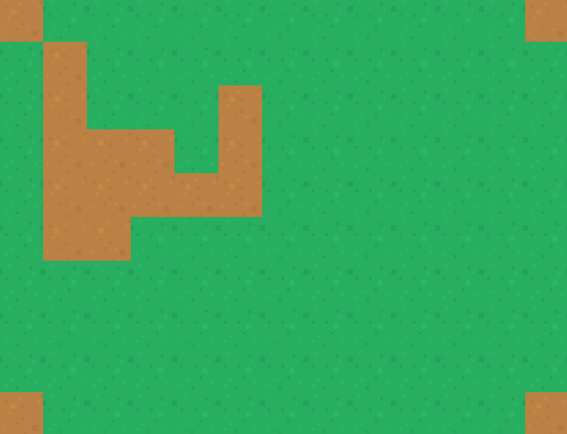

# Ludum Dare 42 theme: Running out of space
## Turn-based strategy, no name yet


## Dependencies

- SFML (tested with v2.4.2)

## Building from source

Install dependencies on Ubuntu:

`sudo apt install libsfml-dev`

```
1. Clone the repo
2. mkdir build && cp -r assets/ build/ && cd build
3. cmake ..
4. make -j
```

## Assets

- https://opengameart.org/content/medieval-rts-120 by Kenney (public domain)

- https://opengameart.org/content/lpc-medieval-fantasy-character-sprites by wulax (CC-BY-SA 3.0 GPL 3.0)

- https://opengameart.org/content/ui-pack-rpg-extension by Kenney (public domain)

- https://opengameart.org/content/crosshair-pack-200%C3%97 by Kenney (public domain)

### Music

- https://opengameart.org/content/adventure-begins by bart (GPL 3.0**

### Fonts

- https://www.dafont.com/caviar-dreams.font by Lauren Thompson (100% free)

## Screenshots

12/08/2018 20:27 BST - basic gui


12/08/2018 11:50 BST - two units


11/08/2018 18:05 BST - unit on a map


11/08/2018 14:56 BST - basic map



